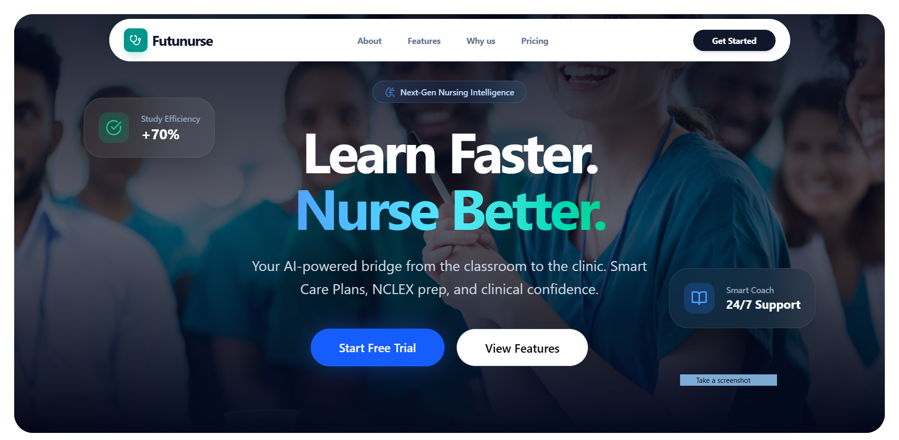

# Futunurse 🩺💻

<div align="center">



**A modern, high-performance developer portfolio built with Next.js**

[View Live Demo](https://futunurse.vercel.app) · [Report Bug](https://github.com/kazisola/futunurse/issues) · [Request Feature](https://github.com/kazisola/futunurse/issues)


</div>

---

## 📋 Overview

Futunurse is a professionally crafted developer portfolio designed to make a lasting impression on recruiters and hiring managers. Built with modern web technologies, it showcases projects, skills, and professional experience through an intuitive, responsive interface optimized for both desktop and mobile viewing.

---

## ✨ Key Features

### 🎨 **Modern User Interface**
- Fully responsive layout that adapts to any screen size
- Dark/light mode support
- Smooth page transitions and micro-interactions
- Accessibility-focused design (WCAG compliant)

### ⚡ **Performance Optimized**
- Server-side rendering (SSR) for instant page loads
- Optimized images with Next.js Image component
- Lazy loading for improved initial load time
- Minimal JavaScript bundle size

### 🛠️ **Comprehensive Project Showcase**
- Detailed project descriptions with live demos
- Technology stack highlighting
- GitHub repository links
- Project screenshots and video demonstrations

---

## 📸 Screenshots

<details>
<summary>Click to view screenshots</summary>

### Home Page

*Hero section with compelling introduction and CTA*

### Projects Section

*Interactive project showcase with filtering options*

### Contact Form

*Professional contact form with validation*

</details>

---

## 🛠️ Tech Stack

### Frontend
- **Framework**: Next.js 15.5 (App Router with Turbopack)
- **UI Library**: React 19.1
- **Styling**: Tailwind CSS
- **Animations**: Framer Motion
- **UI Components**: Radix UI, shadcn/ui
- **Icons**: Lucide React, React Icons
- **Charts**: Recharts 3.5
- **State Management**: Redux Toolkit

### Backend & Database
- **Runtime**: Node.js
- **Database**: MongoDB
- **ODM**: Mongoose
- **Authentication**: NextAuth.js
- **API**: Next.js API Routes

### Development Tools
- **Language**: TypeScript
- **Linting**: ESLint 9 with Next.js config
- **Package Manager**: npm/yarn/pnpm

### Deployment
- **Platform**: Vercel
- **CI/CD**: Automatic deployments via Git integration

---

## 🚀 Getting Started

### Prerequisites

Ensure you have the following installed:
- Node.js 18.0 or higher
- npm, yarn, or pnpm

### Installation

1. **Clone the repository**
   ```bash
   git clone https://github.com/kazisola/futunurse.git
   cd futunurse
   ```

2. **Install dependencies**
   ```bash
   npm install
   # or
   yarn install
   # or
   pnpm install
   ```

3. **Set up environment variables**
   
   Create a `.env.local` file in the root directory:
   ```env
   # Database
   MONGODB_URI=your_mongodb_connection_string
   
   # NextAuth
   NEXTAUTH_URL=http://localhost:3000
   NEXTAUTH_SECRET=your_nextauth_secret
   
   # Add other environment variables as needed
   ```

4. **Run the development server**
   ```bash
   npm run dev
   # or
   yarn dev
   # or
   pnpm dev
   ```
   
   The app will use Turbopack for faster builds during development.

5. **Open in browser**
   
   Navigate to [http://localhost:3000](http://localhost:3000) to see the result.

### Build for Production

```bash
npm run build
npm start
```

---

## 👨‍💻 About Me

Hi, I'm **Kazi Solayman** – a Full-Stack Web Developer specializing in creating high-performance, user-centric web applications. With expertise in modern JavaScript frameworks and a passion for clean code, I build solutions that bridge the gap between design and functionality.

### 🎯 Expertise
- Full-Stack Web Development (MERN Stack)
- Next.js & React.js Application Development
- Responsive UI/UX Design
- RESTful API Design & Integration
- Database Management (MongoDB, PostgreSQL)

### 📍 Location
Louisiana, USA

### 🌟 What I Bring
- Strong problem-solving skills with attention to detail
- Experience building scalable, maintainable applications
- Commitment to writing clean, documented code
- Passion for continuous learning and staying current with tech trends

---

## 🤝 Connect With Me

I'm always open to discussing new opportunities, collaborations, or just chatting about web-application development!

- 📧 **Email**: [kazisolayman123@gmail.com](mailto:kazisolayman123@gmail.com)
- 💼 **LinkedIn**: [linkedin.com/in/kazisola](https://linkedin.com/in/kazisola)
- 🐙 **GitHub**: [github.com/kazisola](https://github.com/kazisola)

---

## 🙏 Acknowledgments

- Design inspiration from modern portfolio trends
- Icons provided by [Lucide Icons](https://lucide.dev)
- Deployed seamlessly on [Vercel](https://vercel.com)

---

<div align="center">

**Built with ❤️ and ☕ by Kazi Solayman**

⭐ Star this repo if you find it to be cool!

</div>
