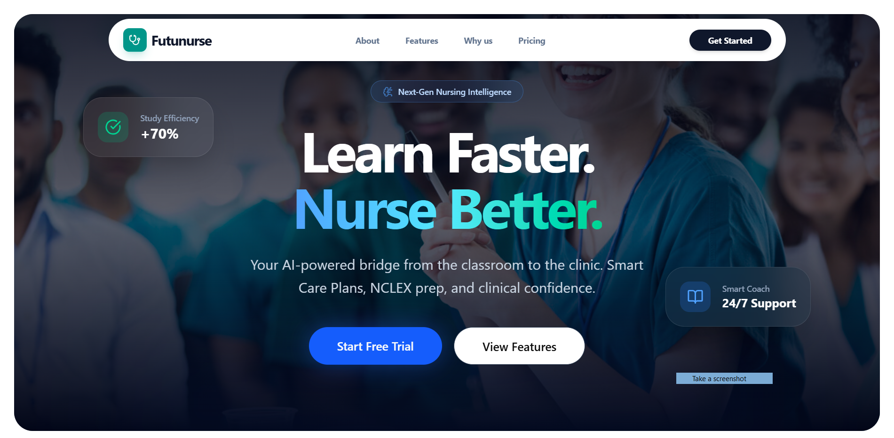
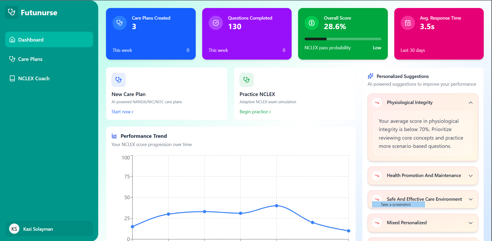

<div align="center">
<h1>Futunurse — AI-Powered Nursing Education</h1>



**Full-Stack AI-Powered Nursing Education Platform built with Next.js, TypeScript, MongoDB, and Docker**

[View Live Demo](https://futunurse.vercel.app) · [Report Bug](https://github.com/kazisola/futunurse/issues) · [Request Feature](https://github.com/kazisola/futunurse/issues)


</div>

---

## 📋 Overview

Futunurse is a **full-stack AI-powered web application** designed to help nursing students create care plans, study medications and diagnostics, and prepare for the NCLEX.

The project demonstrates modern **full-stack software engineering** practices including **TypeScript development, REST API design, database modeling, authentication, AI/LLM integration, state management, responsive UI development, Docker containerization, and production deployment**.

Built with a focus on **scalable architecture, reusable components, performance, and real-world user experience**.

---

## ✨ Features

### 🩺 AI-Powered Care Plan Generator

* **AI Integration** - Generate comprehensive patient care plans using Google Gemini
* **Structured Data** - Generate organized diagnoses, interventions, goals, and outcomes
* **Interactive Editing** - Critique, modify, and refine AI-generated content
* **Persistent Storage** - Save and manage care plans using MongoDB
* **Bookmark System** - Organize frequently referenced care plans

### 💊 Drug & Medication Companion

* **AI-Powered Search** - Enter a drug or medication name and receive a detailed overview
* **Clinical Information** - Drug class, uses, mechanism, side effects, precautions, and more
* **Nursing Considerations** - Focused information about monitoring, administration, and patient education
* **AI-Powered Summarization** - Converts complex medication information into study-friendly content

### 🧪 Lab & Diagnostic Companion

* **AI-Powered Search** - Search laboratory tests and diagnostic procedures
* **Clinical Overview** - Understand the purpose and significance of each test
* **Result Interpretation** - Learn about important abnormal findings
* **Nursing Considerations** - Patient preparation, monitoring, and clinical responsibilities

### 📝 NCLEX Simulator

* **Practice Testing** - NCLEX-style nursing questions and exams
* **Category-Based Testing** - Practice specific nursing subjects
* **Performance Tracking** - Store and analyze test results
* **Analytics Dashboard** - Visualize performance using interactive charts
* **Weak Area Detection** - Identify categories requiring additional practice
* **AI Recommendations** - Generate personalized study recommendations

### 🎨 Modern UI/UX

* **Responsive Design** - Mobile-first interface optimized for all screen sizes
* **Reusable Components** - Modular React component architecture
* **State Management** - Redux Toolkit for predictable client-side state
* **Animations** - Framer Motion micro-interactions and transitions
* **Data Visualization** - Interactive analytics with Recharts
* **Accessible UI** - Radix UI and shadcn/ui components

### ⚡ Performance & Optimization

* **Next.js App Router** - Modern React architecture
* **Server-Side Rendering (SSR)** - Improved performance and user experience
* **Code Splitting & Lazy Loading** - Optimized application loading
* **Next.js Image Optimization** - Efficient image delivery
* **Production Builds** - Optimized Next.js standalone deployment

### 🐳 Docker & DevOps

* **Dockerized Application** - Containerized production environment
* **Docker Compose** - Multi-container application orchestration
* **Multi-Stage Docker Builds** - Separate dependency, build, and runtime stages
* **Node.js 22 Alpine** - Lightweight production runtime
* **MongoDB 8** - Containerized database
* **Persistent Volumes** - Persistent MongoDB data storage
* **Environment Configuration** - Secure environment-based secrets and configuration

---

## 📸 Screenshots

<details>
<summary>Click to view screenshots</summary>

### Home Page

*Hero section with compelling introduction and CTA*

### Dashboard Page

*Dynamic and interactive dashboard with real-time data*

### AI-Care Plans Generator

*AI-Powered patient care plan generator*

### Nursing Test Simulator (NCLEX)

*Nursing test simulator*

### Home Page
*Modern responsive landing page with clear CTAs and product overview*

### Dashboard Page
*Interactive student dashboard with personalized data and analytics*

### AI Care Plan Generator
*AI-powered patient care plan generation and customization*

### Drug & Medication Companion
*AI-powered medication information and nursing considerations*

### Lab & Diagnostic Companion
*AI-powered laboratory and diagnostic learning tool*

### NCLEX Simulator
*Interactive nursing test simulator with performance analytics*

</details>

---

## 🛠️ Tech Stack

### Frontend

* **Next.js 15.5** — App Router, Server Components, SSR
* **React 19.1**
* **TypeScript**
* **Tailwind CSS**
* **Framer Motion**
* **shadcn/ui**
* **Radix UI**
* **Redux Toolkit**
* **Recharts**
* **Lucide React**

### Backend

* **Node.js**
* **Next.js API Routes**
* **REST APIs**
* **TypeScript**
* **Mongoose**
* **MongoDB**
* **JWT Authentication**
* **NextAuth.js**
* **Google OAuth**

### AI / LLM

* **Google Gemini API**
* **Generative AI Integration**
* **Structured AI Responses**
* **AI-Powered Content Generation**
* **AI-Powered Recommendations**

### DevOps

* **Docker**
* **Docker Compose**
* **Multi-Stage Builds**
* **Node.js 22 Alpine**
* **MongoDB Docker Volume**
* **Environment-Based Configuration**

### Development

* **Git / GitHub**
* **ESLint**
* **npm**
* **Turbopack**
* **TypeScript**

### Deployment

* **Vercel**
* **Production CI/CD via Git Integration**
* **Dockerized Production Environment**

---

## 🏗️ Architecture

```text
                         Futunurse
                             │
             ┌───────────────┴───────────────┐
             │                               │
        Next.js Frontend                API Layer
        React + TypeScript          Next.js API Routes
             │                               │
             └───────────────┬───────────────┘
                             │
              ┌──────────────┴──────────────┐
              │                             │
          MongoDB                       Gemini AI
         + Mongoose                    AI Services
              │
       Persistent Storage
```

Docker Compose runs the application and database as separate services:

```text
Docker Compose
│
├── Futunurse
│   └── Next.js + Node.js 22
│
└── MongoDB 8
    └── Persistent Docker Volume
```

---

## 🚀 Getting Started

### Prerequisites

* Node.js 18+
* npm, yarn, or pnpm
* MongoDB

For Docker:

* Docker
* Docker Compose

### Installation

```bash
git clone https://github.com/kazisola/futunurse.git
cd futunurse
npm install
```

Create a `.env.local` file:

```env
MONGODB_URI=your_mongodb_connection_string

NEXTAUTH_SECRET=your_nextauth_secret

JWT_SECRET=your_jwt_secret
JWT_EXPIRES_IN=7d

GOOGLE_CLIENT_ID=your_google_client_id
GOOGLE_CLIENT_SECRET=your_google_client_secret

GEMINI_API_KEY=your_gemini_api_key
```

Run the development server:

```bash
npm run dev
```

Open `http://localhost:3000`.

### 🐳 Docker

Run the complete application stack:

```bash
docker compose up --build
```

Stop the containers:

```bash
docker compose down
```

---

## 💡 Engineering Highlights

* Full-stack **TypeScript** development
* **React / Next.js** application architecture
* RESTful API development
* **MongoDB / Mongoose** database modeling
* JWT and OAuth authentication
* **Google Gemini AI integration**
* Redux Toolkit state management
* Responsive and accessible UI development
* Interactive data visualization
* Docker containerization
* Multi-stage production builds
* Docker Compose orchestration
* Environment-based configuration
* Production deployment and CI/CD
* Performance optimization and code splitting

---

**Built with ❤️ and ☕ by Kazi Solayman — Full Stack Developer**

⭐ Star this repo if you find it useful!
